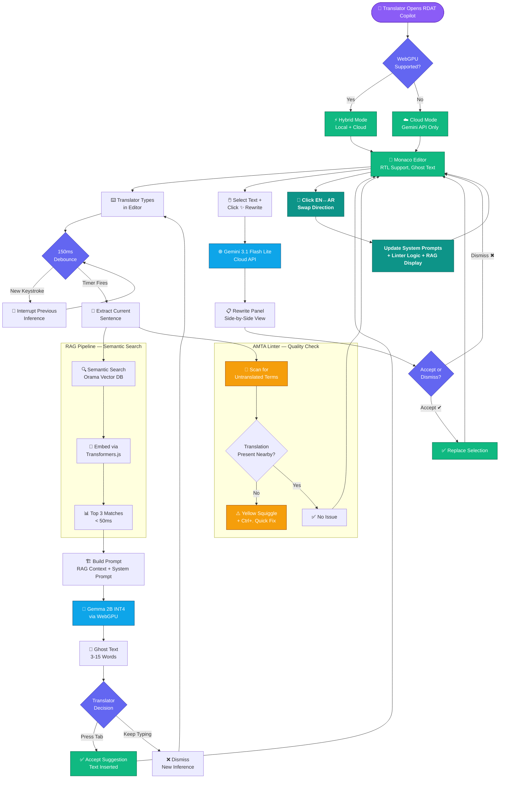

<div align="center">

# RDAT Copilot

**مساعد الترجمة الذكي — Repository-Driven Adaptive Translation**

[](https://github.com/waleedmandour/rdat-pwa/actions/workflows/ci.yml)
[](https://vercel.com/new/clone?repository-url=https://github.com/waleedmandour/rdat-pwa)
[](LICENSE)

A Progressive Web App that provides a full-featured, AI-powered co-writing environment for English-Arabic translation — running entirely in the browser. Built on a dual-track AI architecture that combines a Sovereign Track (local WebGPU inference via Gemma) and a Reasoning Track (cloud Gemini API). All translation decisions are guided by an in-browser RAG vector database and an AMTA terminology linter.

</div>

---

## Author & Affiliation

**Dr. Waleed Mandour**
Sultan Qaboos University (جامعة السلطان قابوس)

RDAT Copilot is a research-informed translation technology tool designed for professional translators working between English and Arabic. It embodies a non-destructive editing philosophy — AI never overwrites the translator's text — and provides intelligent, context-aware suggestions that respect the translator's creative authority.

---

## Table of Contents

- [Architecture Overview](#architecture-overview)
- [Dual-Track AI System](#dual-track-ai-system)
  - [Sovereign Track — المسار السيادي (Local WebGPU)](#sovereign-track--المسار-السيادي-local-webgpu)
  - [Reasoning Track — مسار الاستدلال (Cloud Gemini)](#reasoning-track--مسار-الاستدلال-cloud-gemini)
  - [Track Comparison — مقارنة المسارين](#track-comparison--مقارنة-المسارين)
- [RAG Pipeline — محرك البحث الدلالي](#rag-pipeline--محرك-البحث-الدلالي)
- [AMTA Terminology Linter — فحص جودة الترجمة](#amta-terminology-linter--فحص-جودة-الترجمة)
- [Bilingual Interface — واجهة ثنائية اللغة](#bilingual-interface--واجهة-ثنائية-اللغة)
- [Installing as a PWA — تثبيت كتطبيق](#installing-as-a-pwa--تثبيت-كتطبيق)
- [Setting Up Gemini (BYOK)](#setting-up-gemini-byok)
- [Development — التطوير](#development--التطوير)
- [Deployment — النشر](#deployment--النشر)
- [Project Structure](#project-structure)
- [Tech Stack](#tech-stack)
- [License](#license)
- [User Guide (XML)](#user-guide-for-translation-students--دليل-المستخدم-لطلاب-الترجمة)
- [Cheat Sheet](#cheat-sheet--الورقة-المرجعية-السريعة)
- [Workflow Diagram](#workflow-diagram--مخطط سير العمل)

---

## Architecture Overview

### System Workflow Diagram — مخطط سير العمل



### Architecture Layers

RDAT Copilot is a client-side Progressive Web App built with Next.js 16, Monaco Editor, and WebGPU. It runs entirely in the browser — no backend server required for core functionality. The architecture follows a **non-destructive editing philosophy**: AI never overwrites the translator's text. Ghost text appears as inline suggestions (press Tab to accept), and heavier cloud rewrites are presented in an approval panel.

The system is organized into five functional layers:

1. **Editor Layer — طبقة المحرر** — Monaco Editor with RTL support, syntax-aware inline completions, and a custom `rdat-translation` language ID.
2. **Event Loop Layer — طبقة الأحداث** — A debounced keystroke handler with AbortController lifecycle. Every keystroke resets a 300ms debounce; when it fires, RAG retrieval and AMTA linting run in parallel. If inference is active on a new keystroke, `interruptGenerate()` cancels immediately.
3. **RAG Layer — طبقة البحث الدلالي** — An Orama vector database in a dedicated Web Worker. Embeddings via Transformers.js (with deterministic hash fallback). Semantic search returns the top 3 translation memory matches in under 50ms.
4. **AI Layer — طبقة الذكاء الاصطناعي** — Dual-track: Sovereign (local Gemma via WebGPU for real-time ghost text) + Reasoning (Gemini from the browser for rewriting).
5. **Linting Layer — طبقة الفحص** — The AMTA linter scans for untranslated English legal terms, draws yellow squiggles, and offers Ctrl+. autocorrections.

---

## Dual-Track AI System

### Sovereign Track — المسار السيادي (Local WebGPU)

The Sovereign Track runs a quantized Gemma 2B model entirely in the browser using [WebLLM](https://github.com/mlc-ai/web-llm). This provides real-time ghost text — short inline completion suggestions (3–15 words) that appear as you type.

**How it works:**

1. When the debounce timer fires after a keystroke, the event loop extracts the current sentence from the editor text.
2. The sentence is truncated for embedding safety and sent to the RAG Web Worker for semantic search.
3. The top 3 RAG results (English→Arabic translation pairs) are injected into a system prompt constraining the LLM to output only ghost text completions.
4. The prompt is sent to the WebLLM engine running Gemma 2B (INT4 quantized) via WebGPU.
5. Generated text appears as a ghost text suggestion — the translator presses Tab to accept or continues typing to dismiss.

**Latency Trap Prevention — منع اختبار الكمون:**

Every keystroke while inference is running fires `engine.interruptGenerate()` through a two-layer cancellation system: Monaco's `CancellationToken` and a custom `AbortController`. Stale completions never appear and the GPU is freed immediately.

**Gemma 4 Roadmap — خارطة طريق جيما 4:**

RDAT Copilot targets the [Gemma 4](https://deepmind.google/models/gemma/gemma-4/) model family by Google DeepMind for the Sovereign Track. The current release uses Gemma 2B (INT4 quantized) as the most performant model available in the WebLLM framework. Integration of Gemma 4 will be enabled as soon as WebLLM releases compatible model weights, delivering significantly enhanced translation quality for the local inference path.

### Reasoning Track — مسار الاستدلال (Cloud Gemini)

The Reasoning Track uses Google's Gemini API for heavier tasks requiring more reasoning capacity than the local 2B model.

**How it works:**

1. The translator selects text in the editor and clicks "✨ Rewrite" (إعادة صياغة).
2. The selected text, along with RAG context, is sent to Gemini directly from the browser.
3. Gemini generates a rewritten version matching formal legal register in Arabic.
4. Results appear in a side panel — the translator clicks "Accept" (قبول) or "Dismiss" (رفض).

**BYOK Architecture — أدخل مفتاحك الخاص:**

The Gemini API key is stored in the browser's `localStorage` and never sent to any server other than Google's. Each user provides their own key through Settings. `gemini-3.1-flash-lite-preview` is the current Free Tier model — zero cost for the developer, budget-friendly for all users.

### Track Comparison — مقارنة المسارين

| Aspect | Sovereign Track — المسار السيادي | Reasoning Track — مسار الاستدلال |
|--------|----------------|-----------------|
| **Purpose** | Ghost text suggestions | Heavy rewriting and synthesis |
| **Model** | Gemma 2B (INT4, local) | Gemini 3.1 Flash Lite (cloud) |
| **Trigger** | Automatic on keystroke (debounced) | Manual: select + click Rewrite |
| **Output** | 3–15 word inline ghost text | Full passage in side panel |
| **UI** | Tab to accept | Accept/Dismiss panel |
| **Latency** | Target: <200ms | ~1–3s |
| **Network** | Offline after model download | Requires internet |
| **API Key** | None needed | User-provided (BYOK) |

---

## RAG Pipeline — محرك البحث الدلالي

The Retrieval-Augmented Generation pipeline provides translation memory context for both AI tracks, running entirely in a Web Worker.

**Components:**

- **Orama Vector Database** — In-memory store with 384-dimensional embeddings and cosine similarity search.
- **Transformers.js** — `paraphrase-multilingual-MiniLM-L12-v2` for real semantic embeddings. Falls back to deterministic hash-based pseudo-embeddings on failure.
- **Corpus** — JSON glossary of English→Arabic legal/technical term pairs (`opus-glossary-en-ar.json`).

**Flow:**

1. On startup, the worker fetches the corpus, generates embeddings, and indexes them in Orama.
2. On typing (debounced), the current sentence is embedded and vector-searched.
3. Top 3 matches with scores and timing are returned and injected into the LLM prompt.

**Performance:** Vector search < 50ms (verified with ✓/⚠ console indicator).

---

## AMTA Terminology Linter — فحص جودة الترجمة

The AMTA linter scans the editor for untranslated English legal terms from the glossary corpus.

**How it works:**

1. After the editor debounce settles (2-second delay), the linter scans the full editor text.
2. For each English term in the glossary, it performs a case-insensitive search.
3. If an English term is found but the Arabic translation is not present nearby, a lint issue is created.
4. Issues appear as **yellow squiggly warnings** via Monaco's `setModelMarkers`.
5. A **CodeActionProvider** enables **Ctrl+.** quick fixes: `AMTA: Replace "Force Majeure" → "القوة القاهرة"`.

---

## Bilingual Interface — واجهة ثنائية اللغة

RDAT Copilot features a fully bilingual Arabic-English interface, designed for professional translators who work between English and Arabic. Following the design language of [Gemma 4](https://deepmind.google/models/gemma/gemma-4/), every UI element displays an Arabic subtitle followed by its English description:

- **Header**: "مساعد الترجمة الذكي" — Intelligent Translation Assistant
- **Sidebar**: All menu items include Arabic labels (محرر الترجمة, مسرد المصطلحات, نماذج الذكاء الاصطناعي)
- **Status Bar**: Bilingual mode indicators (سيادي / سحابي / هجين)
- **Settings**: Arabic section headers (عام, اللغات, مفاتيح API, نماذج الذكاء الاصطناعي)
- **Welcome Page**: Arabic hero title "مرحبًا بك في RDAT Copilot" with Quick Start cards
- **Ghost Text Hint**: "اضغط Tab لقبول · نص مقترح" — Press Tab to accept

The IDE layout remains LTR (left-to-right) for optimal editor experience, while Arabic text spans use `dir="rtl"` for correct rendering. Arabic labels are styled in a subtle teal accent to provide visual distinction without overwhelming the interface.

---

## Installing as a PWA — تثبيت كتطبيق

RDAT Copilot is a fully installable Progressive Web App:

### Desktop (Chrome / Edge)
1. Navigate to the deployed URL.
2. Click the **install icon** (⊕) in the address bar, or three-dot menu → "Install RDAT Copilot".
3. The app opens in a standalone window like a native desktop application.

### Mobile (Android)
1. Open the URL in Chrome.
2. Tap **"Add to Home Screen"** banner, or menu → "Install app".

### iOS (Safari)
1. Open the URL in Safari.
2. Tap **Share** → "Add to Home Screen".

### PWA Features
- **Offline-Ready:** Service worker caches all static assets. Sovereign Track works fully offline after model download.
- **Background Sync:** Workbox runtime caching for Google Fonts.
- **Installable:** Meets Chrome's installability criteria (manifest, service worker, HTTPS).

---

## Setting Up Gemini (BYOK)

The Reasoning Track requires a free API key from Google AI Studio:

1. Go to [Google AI Studio](https://aistudio.google.com/apikey) → **Create API Key**.
2. In RDAT Copilot, click the **⚙️ gear icon** → **"مفاتيح API"** tab.
3. Paste your key → **"Save"**.

The key is stored in `localStorage` and never sent to any server except Google's API. `gemini-3.1-flash-lite-preview` is on the **Free Tier**.

---

## Development — التطوير

### Prerequisites

- **Node.js** 20+ (LTS)
- **npm** 10+

### Setup

```bash
git clone https://github.com/waleedmandour/rdat-pwa.git
cd rdat-pwa
npm install
npm run dev
```

### Build

```bash
# Standard build (Vercel / Node.js server)
npm run build

# GitHub Pages static export (with basePath)
npm run build:ghpages
```

### Commands

| Command | Description |
|---------|-------------|
| `npm run dev` | Start development server on port 3000 |
| `npm run build` | Standard Next.js build (for Vercel) |
| `npm run build:ghpages` | Static export with `/rdat-pwa` basePath |
| `npm run start` | Start Next.js production server |
| `npm run lint` | Run ESLint checks |

---

## Deployment — النشر

### Vercel (Recommended — موصى به)

Vercel provides automatic builds from Git, edge CDN, and native Next.js optimization:

1. Go to [vercel.com](https://vercel.com) → Sign in with GitHub.
2. **Add New Project** → Select `rdat-pwa` → **Deploy**.

Vercel automatically:
- Builds on every push to `main`
- Serves from global edge CDN
- Applies COOP/COEP headers for SharedArrayBuffer (WebGPU + WASM)
- Caches `.wasm` and model shards with immutable headers
- Handles PWA service worker correctly

**Live:** `https://rdat-pwa.vercel.app/`

### GitHub Pages (Static Export)

1. Build: `npm run build:ghpages`
2. Deploy the `out/` directory.

> **Note:** GitHub Pages cannot set COOP/COEP headers, so WebGPU SharedArrayBuffer may not work there. Use Vercel for the full experience.

---

## Project Structure

```
rdat-pwa/
├── .github/workflows/
│   └── ci.yml                  # CI pipeline (lint + build)
├── public/
│   ├── manifest.json           # PWA manifest
│   ├── opus-glossary-en-ar.json # EN-AR legal/technical glossary
│   ├── favicon.ico
│   ├── logo.svg
│   └── icons/                  # PWA icons (72–512px)
├── src/
│   ├── app/
│   │   ├── layout.tsx          # Root layout (PWA meta, dark theme)
│   │   ├── page.tsx            # Entry point → WorkspaceShell
│   │   └── globals.css         # Tailwind + VS Code dark palette
│   ├── components/
│   │   ├── ErrorBoundary.tsx   # Client-side error recovery UI
│   │   ├── gpu/
│   │   │   ├── GPUStatusIndicator.tsx
│   │   │   └── WebGPUBanner.tsx
│   │   ├── settings/
│   │   │   └── SettingsModal.tsx    # BYOK UI, 4-tab dialog
│   │   └── workspace/
│   │       ├── Header.tsx           # Top bar (bilingual labels)
│   │       ├── Sidebar.tsx          # Collapsible, translator shortcuts
│   │       ├── StatusBar.tsx        # Bilingual indicators
│   │       ├── MonacoEditor.tsx     # Monaco with inline completions
│   │       ├── WorkspaceShell.tsx   # Main IDE orchestrator
│   │       └── EditorWelcome.tsx    # Welcome page (Arabic hero)
│   ├── hooks/
│   │   ├── useAMTALinter.ts    # AMTA: markers + CodeActionProvider
│   │   ├── useAppMode.ts       # Mode derivation from GPU
│   │   ├── useEditorEventLoop.ts # Debounce → abort → inference
│   │   ├── useGemini.ts        # Gemini client (localStorage BYOK)
│   │   ├── useRAG.ts           # RAG Worker lifecycle
│   │   ├── useServiceWorker.ts # PWA online/offline
│   │   ├── useWebGPU.ts        # SSR-safe WebGPU detection
│   │   └── useWebLLM.ts        # WebLLM engine + ghost text
│   ├── lib/
│   │   ├── amta-linter.ts      # Terminology scanner
│   │   ├── asset-url.ts        # basePath-aware URL resolver
│   │   ├── constants.ts        # Config + bilingual UI labels
│   │   ├── gemini-provider.ts  # Client-side Gemini wrapper
│   │   ├── gpu-utils.ts        # GPU info utilities
│   │   ├── prompt-builder.ts   # LLM prompt + RAG fusion
│   │   ├── rag-types.ts        # RAG TypeScript types
│   │   ├── sentence-extractor.ts
│   │   └── utils.ts
│   ├── types/index.ts
│   └── workers/rag-worker.ts   # RAG Web Worker
├── next.config.ts              # Vercel config (COOP/COEP, WASM)
├── vercel.json                 # Routing + cache headers
├── package.json
└── tsconfig.json
```

---

## Tech Stack

| Layer | Technology | Purpose |
|-------|-----------|---------|
| **Framework** | Next.js 16 | React framework, edge optimization |
| **Deployment** | Vercel | Auto-builds, CDN, native Next.js |
| **Language** | TypeScript 5 | Type safety |
| **Styling** | Tailwind CSS 4 | VS Code dark palette |
| **Editor** | Monaco Editor | Inline completions, markers |
| **Local AI** | WebLLM (Gemma 2B INT4) | In-browser GPU inference |
| **Cloud AI** | Google Gemini (Flash Lite) | Client-side rewrite API |
| **Embeddings** | Transformers.js | Browser-based embeddings |
| **Vector DB** | Orama | In-memory RAG vector store |
| **PWA** | `@ducanh2912/next-pwa` | Service worker + Workbox |
| **CI** | GitHub Actions | Lint + build validation |

---

## License

MIT — See [LICENSE](LICENSE) for details.

---

<div align="center">
<strong>Dr. Waleed Mandour</strong> · Sultan Qaboos University · جامعة السلطان قابوس

Powered by WebGPU, Transformers.js, Orama, and Google Gemini
</div>

---

## User Guide for Translation Students — دليل المستخدم لطلاب الترجمة

> The complete user guide is provided in structured XML format below, suitable for parsing, conversion to other formats, or integration into documentation systems.

<details>
<summary><strong>📖 Click to expand the full XML User Guide</strong></summary>

```xml
<?xml version="1.0" encoding="UTF-8"?>
<?xml-stylesheet type="text/xsl" href="rdat-user-guide.xsl"?>
<!-- ═══════════════════════════════════════════════════════════════════════════
     RDAT Copilot — User Guide for Translation Students
     Author: Dr. Waleed Mandour
     Affiliation: Sultan Qaboos University (جامعة السلطان قابوس)
     Version: 2.0.0
     Date: 2026-04-04
     License: MIT
     ═══════════════════════════════════════════════════════════════════════════ -->
<document
  xmlns="https://rdat-copilot.dev/schema/user-guide"
  xmlns:xsi="http://www.w3.org/2001/XMLSchema-instance"
  xsi:schemaLocation="https://rdat-copilot.dev/schema/user-guide rdat-user-guide.xsd"
  id="rdat-copilot-user-guide"
  lang="ar-en"
  version="2.0.0">

  <!-- ── Metadata ──────────────────────────────────────────────────────── -->
  <metadata>
    <title>
      <ar>دليل استخدام RDAT Copilot لطلاب الترجمة</ar>
      <en>RDAT Copilot User Guide for Translation Students</en>
    </title>
    <subtitle>
      <ar>المساعد الذكي للترجمة — بيئة التحرير المتكاملة بالذكاء الاصطناعي</ar>
      <en>Intelligent Translation Assistant — AI-Powered Co-Writing IDE</en>
    </subtitle>
    <author>
      <name>Dr. Waleed Mandour</name>
      <nameAr>د. وليد مندور</nameAr>
      <affiliation>Sultan Qaboos University</affiliation>
      <affiliationAr>جامعة السلطان قابوس</affiliation>
      <department>Department of Foreign Languages and Literature</department>
      <country>Oman</country>
    </author>
    <application>
      <name>RDAT Copilot</name>
      <shortName>RDAT</shortName>
      <fullName>Repository-Driven Adaptive Translation Copilot</fullName>
      <version>2.0.0</version>
      <url>https://rdat-pwa.vercel.app/</url>
      <repository>https://github.com/waleedmandour/rdat-pwa</repository>
      <license>MIT</license>
      <logo>public/logo.svg</logo>
      <iconPath>public/icons/icon-512x512.png</iconPath>
    </application>
    <audience>
      <primary>Translation students (undergraduate and graduate)</primary>
      <primaryAr>طلاب الترجمة (البكالوريوس والدراسات العليا)</primaryAr>
      <secondary>Professional translators working between English and Arabic</secondary>
      <secondaryAr>المترجمون المحترفون العاملون بين الإنجليزية والعربية</secondaryAr>
    </audience>
    <dateCreated>2026-04-04</dateCreated>
    <dateModified>2026-04-04</dateModified>
  </metadata>

  <!-- ── Table of Contents ─────────────────────────────────────────────── -->
  <toc>
    <section ref="introduction" number="1">
      <ar>مقدمة</ar><en>Introduction</en>
    </section>
    <section ref="getting-started" number="2">
      <ar>البدء السريع</ar><en>Getting Started</en>
    </section>
    <section ref="interface-overview" number="3">
      <ar>نظرة عامة على الواجهة</ar><en>Interface Overview</en>
    </section>
    <section ref="sovereign-track" number="4">
      <ar>المسار السيادي — الترجمة بالذكاء الاصطناعي المحلي</ar><en>Sovereign Track — Local AI Translation</en>
    </section>
    <section ref="reasoning-track" number="5">
      <ar>مسار الاستدلال — إعادة الصياغة السحابية</ar><en>Reasoning Track — Cloud Rewriting</en>
    </section>
    <section ref="rag-system" number="6">
      <ar>نظام البحث الدلالي (RAG)</ar><en>Retrieval-Augmented Generation (RAG)</en>
    </section>
    <section ref="amta-linter" number="7">
      <ar>فحص جودة الترجمة (AMTA)</ar><en>Translation Quality Linting (AMTA)</en>
    </section>
    <section ref="keyboard-shortcuts" number="8">
      <ar>اختصارات لوحة المفاتيح</ar><en>Keyboard Shortcuts</en>
    </section>
    <section ref="pwa-installation" number="9">
      <ar>تثبيت التطبيق</ar><en>PWA Installation</en>
    </section>
    <section ref="troubleshooting" number="10">
      <ar>حل المشكلات</ar><en>Troubleshooting</en>
    </section>
    <section ref="glossary" number="A">
      <ar>ملحق: مسرد المصطلحات</ar><en>Appendix: Glossary of Terms</en>
    </section>
  </toc>

  <!-- ════════════════════════════════════════════════════════════════════
       SECTION 1: Introduction
       ════════════════════════════════════════════════════════════════════ -->
  <section id="introduction">
    <heading>
      <number>1</number>
      <ar>مقدمة</ar>
      <en>Introduction</en>
    </heading>

    <paragraph>
      <ar>
        مرحبًا بك في RDAT Copilot، المساعد الذكي للترجمة الذي صُمم خصيصًا لطلاب الترجمة والمترجمين المحترفين العاملين بين اللغتين الإنجليزية والعربية. هذا التطبيق هو بيئة تحرير متكاملة تعمل بالذكاء الاصطناعي بالكامل داخل متصفحك — لا تحتاج إلى خادم خارجي أو برنامج تنزيل. كل ما تحتاجه هو متصفح حديث واتصال بالإنترنت.
      </ar>
      <en>
        Welcome to RDAT Copilot, the intelligent translation assistant designed specifically for translation students and professional translators working between English and Arabic. This application is a fully AI-powered integrated editing environment that runs entirely inside your browser — no external server or software download is required. All you need is a modern browser and an internet connection.
      </en>
    </paragraph>

    <paragraph>
      <ar>
        يتكامل RDAT Copilot مع نماذج الذكاء الاصطناعي الأحدث من Google DeepMind، بما في ذلك عائلة Gemma للتوليد المحلي وGemini للاستدلال السحابي. يعتمد مبدأ "التحرير غير التدميري": الذكاء الاصطناعي لا يكتب فوق النص أبدًا، بل يقدم اقتراحات ذكية يمكنك قبولها أو رفضها بحرية تامة. هذا يعني أنك تحتفظ بالسيطرة الكاملة على الترجمة النهائية.
      </ar>
      <en>
        RDAT Copilot integrates with the latest AI models from Google DeepMind, including the Gemma family for local generation and Gemini for cloud reasoning. It follows a "non-destructive editing" philosophy: the AI never overwrites your text, instead presenting intelligent suggestions that you can freely accept or reject. This means you retain full control over the final translation.
      </en>
    </paragraph>

    <subsection>
      <heading>
        <ar>ما الذي يجعل RDAT Copilot فريدًا؟</ar>
        <en>What Makes RDAT Copilot Unique?</en>
      </heading>
      <feature-list>
        <feature id="f-dual-ai" category="ai">
          <name>
            <ar>نظام ذكاء اصطناعي مزدوج المسار</ar>
            <en>Dual-Track AI System</en>
          </name>
          <description>
            <ar>
              يجمع التطبيق بين "المسار السيادي" الذي يعمل محليًا على جهازك عبر WebGPU باستخدام نموذج Gemma، و"مسار الاستدلال" الذي يستخدم Gemini السحابي للمهام الأكثر تعقيدًا. يمكنك اختيار المسار المناسب حسب الموقف أو استخدام كليهما معًا.
            </ar>
            <en>
              The app combines a "Sovereign Track" that runs locally on your device via WebGPU using the Gemma model, and a "Reasoning Track" that uses cloud Gemini for more complex tasks. You can choose the appropriate track for each situation or use both together.
            </en>
          </description>
        </feature>
        <feature id="f-non-destructive" category="editing">
          <name>
            <ar>تحرير غير تدميري</ar>
            <en>Non-Destructive Editing</en>
          </name>
          <description>
            <ar>
              الذكاء الاصطناعي لا يستبدل نصك أبدًا. الاقتراحات تظهر كنص شبحي (ghost text) في المحرر، ويمكنك قبولها بالضغط على Tab أو تجاهلها بالاستمرار في الكتابة. حتى في ميزة إعادة الصياغة السحابية، تظهر النتائج في لوحة منفصلة يجب أن توافق عليها صراحة.
            </ar>
            <en>
              The AI never replaces your text. Suggestions appear as ghost text in the editor, and you can accept them by pressing Tab or ignore them by continuing to type. Even in the cloud rewriting feature, results appear in a separate panel that you must explicitly approve.
            </en>
          </description>
        </feature>
        <feature id="f-rag" category="ai">
          <name>
            <ar>محرك بحث دلالي مدمج (RAG)</ar>
            <en>Built-in Semantic Search (RAG)</en>
          </name>
          <description>
            <ar>
              يبحث التطبيق تلقائيًا في قاعدة بيانات المصطلحات القانونية والتقنية أثناء كتابتك، ويستخدم أفضل 3 تطابقات سياقية لتحسين اقتراحات الترجمة. هذا يعني أن الترجمة تكون دائمًا متسقة مع الذاكرة الترجمية المتاحة.
            </ar>
            <en>
              The app automatically searches the legal and technical terminology database as you type, using the top 3 contextual matches to improve translation suggestions. This means your translation is always consistent with the available translation memory.
            </en>
          </description>
        </feature>
        <feature id="f-linter" category="quality">
          <name>
            <ar>فحص جودة الترجمة التلقائي</ar>
            <en>Automatic Translation Quality Linting</en>
          </name>
          <description>
            <ar>
              يفحص النظام نصك تلقائيًا للكشف عن المصطلحات الإنجليزية التي لم تُترجم، ويظهر تحذيرات صفراء أسفل الكلمات مع اقتراحات للتصحيح. يمكنك قبول التصحيح بنقرة واحدة.
            </ar>
            <en>
              The system automatically scans your text to detect English terms that have not been translated, displaying yellow warnings under the words with correction suggestions. You can accept a correction with a single click.
            </en>
          </description>
        </feature>
        <feature id="f-pwa" category="platform">
          <name>
            <ar>تطبيق ويب تقدمي (PWA)</ar>
            <en>Progressive Web App (PWA)</en>
          </name>
          <description>
            <ar>
              ثبّت التطبيق على جهازك كبرنامج مستقل. يعمل بدون إنترنت بعد تحميل النموذج المحلي. متاح على أجهزة الكمبيوتر والهواتف الذكية.
            </ar>
            <en>
              Install the app on your device as a standalone program. Works offline after downloading the local model. Available on desktop and mobile devices.
            </en>
          </description>
        </feature>
      </feature-list>
    </subsection>
  </section>

  <!-- ════════════════════════════════════════════════════════════════════
       SECTION 2: Getting Started
       ════════════════════════════════════════════════════════════════════ -->
  <section id="getting-started">
    <heading>
      <number>2</number>
      <ar>البدء السريع</ar>
      <en>Getting Started</en>
    </heading>

    <subsection>
      <heading>
        <ar>المتطلبات الأساسية</ar>
        <en>Prerequisites</en>
      </heading>
      <requirements>
        <requirement type="browser" mandatory="true">
          <name>
            <ar>متصفح حديث</ar>
            <en>Modern Browser</en>
          </name>
          <details>
            <ar>Google Chrome (الإصدار 113+) أو Microsoft Edge (الإصدار 113+) لتشغيل WebGPU. للعمل بالوضع السحابي فقط، أي متفحح حديث يكفي.</ar>
            <en>Google Chrome (version 113+) or Microsoft Edge (version 113+) for WebGPU support. For cloud-only mode, any modern browser suffices.</en>
          </details>
        </requirement>
        <requirement type="internet" mandatory="true">
          <name>
            <ar>اتصال بالإنترنت (للمرة الأولى)</ar>
            <en>Internet Connection (first time)</en>
          </name>
          <details>
            <ar>لتحميل النموذج المحلي (Gemma 2B) ونماذج التضمين. بعد التحميل الأول، يعمل المسار السيادي بدون إنترنت.</ar>
            <en>To download the local model (Gemma 2B) and embedding models. After the first download, the Sovereign Track works offline.</en>
          </details>
        </requirement>
        <requirement type="gpu" mandatory="false">
          <name>
            <ar>بطاقة رسومات تدعم WebGPU</ar>
            <en>WebGPU-Compatible GPU</en>
          </name>
          <details>
            <ar>اختيارية. إذا لم تتوفر، يتحول التطبيق تلقائيًا إلى الوضع السحابي فقط.</ar>
            <en>Optional. If unavailable, the app automatically switches to cloud-only mode.</en>
          </details>
        </requirement>
        <requirement type="api-key" mandatory="false">
          <name>
            <ar>مفتاح Gemini API (مجاني)</ar>
            <en>Gemini API Key (Free)</en>
          </name>
          <details>
            <ar>مطلوب فقط لميزة إعادة الصياغة السحابية. احصل عليه مجانًا من Google AI Studio.</ar>
            <en>Required only for the cloud rewriting feature. Obtain it for free from Google AI Studio.</en>
          </details>
        </requirement>
      </requirements>
    </subsection>

    <subsection>
      <heading>
        <ar>الخطوة 1: افتح التطبيق</ar>
        <en>Step 1: Open the Application</en>
      </heading>
      <steps>
        <step number="1">
          <action>
            <ar>افتح متصفحك وانتقل إلى العنوان التالي:</ar>
            <en>Open your browser and navigate to the following URL:</en>
          </action>
          <url>https://rdat-pwa.vercel.app/</url>
        </step>
        <step number="2">
          <action>
            <ar>ستظهر شاشة الترحيب مع عنوان "مرحبًا بك في RDAT Copilot". اقرأ الوصف وافهم الأوضاع المتاحة.</ar>
            <en>The welcome screen will appear with the title "مرحبًا بك في RDAT Copilot". Read the description and understand the available modes.</en>
          </action>
        </step>
        <step number="3">
          <action>
            <ar>لاحظ شريط الحالة أسفل الشاشة — فهو يعرض حالة النظام (GPU، RAG، LLM، Gemini).</ar>
            <en>Notice the status bar at the bottom of the screen — it displays the system status (GPU, RAG, LLM, Gemini).</en>
          </action>
        </step>
      </steps>
    </subsection>

    <subsection>
      <heading>
        <ar>الخطوة 2: إعداد مفتاح Gemini API (اختياري)</ar>
        <en>Step 2: Set Up Gemini API Key (Optional)</en>
      </heading>
      <steps>
        <step number="1">
          <action>
            <ar>اذهب إلى Google AI Studio وأنشئ مفتاح API مجاني:</ar>
            <en>Go to Google AI Studio and create a free API key:</en>
          </action>
          <url>https://aistudio.google.com/apikey</url>
        </step>
        <step number="2">
          <action>
            <ar>في RDAT Copilot، انقر على أيقونة ⚙️ الإعدادات في الشريط العلوي.</ar>
            <en>In RDAT Copilot, click the ⚙️ settings icon in the top bar.</en>
          </action>
        </step>
        <step number="3">
          <action>
            <ar>انتقل إلى تبويب "مفاتيح API" والصق المفتاح، ثم انقر "Save".</ar>
            <en>Navigate to the "API Keys" tab, paste the key, and click "Save".</en>
          </action>
        </step>
        <step number="4">
          <action>
            <ar>المفتاح يُخزّن محليًا في متصفحك فقط ولا يُرسل إلى أي خادم.</ar>
            <en>The key is stored locally in your browser only and is never sent to any server.</en>
          </action>
        </step>
      </steps>
    </subsection>

    <subsection>
      <heading>
        <ar>الخطوة 3: ابدأ الترجمة</ar>
        <en>Step 3: Start Translating</en>
      </heading>
      <steps>
        <step number="1">
          <action>
            <ar>من الشريط الجانبي، انقر على "Translation Editor" (محرر الترجمة).</ar>
            <en>From the sidebar, click "Translation Editor".</en>
          </action>
        </step>
        <step number="2">
          <action>
            <ar>ابدأ بكتابة النص العربي في المحرر. ستلاحظ ظهور اقتراحات كنص شبحي (ghost text) باللون الرمادي.</ar>
            <en>Start typing Arabic text in the editor. You will notice suggestions appearing as ghost text in gray.</en>
          </action>
        </step>
        <step number="3">
          <action>
            <ar>اضغط <shortcut>Tab</shortcut> لقبول الاقتراح، أو استمر في الكتابة لتجاهله.</ar>
            <en>Press <shortcut>Tab</shortcut> to accept the suggestion, or continue typing to dismiss it.</en>
          </action>
        </step>
      </steps>
    </subsection>
  </section>

  <!-- ════════════════════════════════════════════════════════════════════
       SECTION 3: Interface Overview
       ════════════════════════════════════════════════════════════════════ -->
  <section id="interface-overview">
    <heading>
      <number>3</number>
      <ar>نظرة عامة على الواجهة</ar>
      <en>Interface Overview</en>
    </heading>

    <paragraph>
      <ar>
        واجهة RDAT Copilot مصممة على طراز بيئات التطوير المتكاملة (IDE) مثل Visual Studio Code، مما يجعلها مألوفة للمستخدمين التقنيين وسهلة التعلم لطلاب الترجمة. الواجهة ثنائية اللغة: كل عنصر يظهر بالعربية أولاً ثم بالإنجليزية.
      </ar>
      <en>
        The RDAT Copilot interface is designed in the style of integrated development environments (IDEs) like Visual Studio Code, making it familiar for technical users and easy to learn for translation students. The interface is bilingual: every element appears in Arabic first, followed by English.
      </en>
    </paragraph>

    <ui-components>
      <component id="header" region="top">
        <name>
          <ar>الشريط العلوي</ar>
          <en>Header Bar</en>
        </name>
        <description>
          <ar>يحتوي على شعار التطبيق واسمه "RDAT Copilot" مع العنوان الفرعي "مساعد الترجمة الذكي". يشمل أزرار فتح/إغلاق الشريط الجانبي، والإعدادات، ومؤشر زوج اللغات "الإنجليزية ← العربية".</ar>
          <en>Contains the app logo and name "RDAT Copilot" with subtitle "مساعد الترجمة الذكي". Includes sidebar toggle buttons, settings, and the language pair indicator "الإنجليزية ← العربية".</en>
        </description>
      </component>

      <component id="sidebar" region="left">
        <name>
          <ar>الشريط الجانبي — المستعرض</ar>
          <en>Sidebar — Explorer</en>
        </name>
        <description>
          <ar>يتضمن قسمين: "WORKSPACE" (مساحة العمل) الذي يحتوي على محرر الترجمة وشاشة الترحيب، و"AI ENGINES" (محركات الذكاء الاصطناعي) الذي يعرض حالة المسار السيادي ومسار الاستدلال. يحتوي أيضًا على قسم "اختصارات المترجم" مع الاختصارات الأساسية.</ar>
          <en>Includes two sections: "WORKSPACE" containing the translation editor and welcome screen, and "AI ENGINES" showing the status of the Sovereign Track and Reasoning Track. Also includes a "Translator Shortcuts" section with essential shortcuts.</en>
        </description>
        <menu-items>
          <menu-item id="editor" shortcut="">
            <ar>محرر الترجمة</ar><en>Translation Editor</en>
          </menu-item>
          <menu-item id="welcome" shortcut="">
            <ar>مرحبًا وخارطة الطريق</ar><en>Welcome &amp; Roadmap</en>
          </menu-item>
        </menu-items>
      </component>

      <component id="editor" region="center">
        <name>
          <ar>محرر Monaco — المحرر الرئيسي</ar>
          <en>Monaco Editor — Main Editor</en>
        </name>
        <description>
          <ar>محرر متقدم مبني على Monaco (نفس محرر VS Code). يدعم النص العربي من اليمين إلى اليسار. يعرض اقتراحات الذكاء الاصطناعي كنص شبحي (ghost text) باللون الرمادي. يعرض تحذيرات AMTA كخطوط صفراء متموجة أسفل المصطلحات غير المترجمة.</ar>
          <en>An advanced editor built on Monaco (the same editor as VS Code). Supports right-to-left Arabic text. Displays AI suggestions as ghost text in gray. Shows AMTA warnings as yellow wavy underlines under untranslated terms.</en>
        </description>
      </component>

      <component id="statusbar" region="bottom">
        <name>
          <ar>شريط الحالة</ar>
          <en>Status Bar</en>
        </name>
        <description>
          <ar>شريط معلوماتي في أسفل الشاشة يعرض: وضع التشغيل (سيادي/سحابي/هجين)، زوج اللغات، حالة الذكاء الاصطناعي، حالة RAG (قاموس)، حالة النموذج المحلي (LLM)، حالة Gemini السحابي، عدد تنبيهات AMTA، حالة GPU، وإصدار التطبيق. كل عنصر يعرض بالعربية والإنجليزية مع مؤشر لوني.</ar>
          <en>An informational bar at the bottom of the screen displaying: operating mode (sovereign/cloud/hybrid), language pair, AI status, RAG status (dictionary), local model (LLM) status, cloud Gemini status, AMTA alert count, GPU status, and app version. Each element displays in Arabic and English with a color indicator.</en>
        </description>
        <status-indicators>
          <indicator id="mode" icon="⚡/☁️/🔋">
            <ar>وضع التشغيل</ar><en>Operating Mode</en>
            <values>
              <value color="emerald">Hybrid (هجين) — Local + Cloud active</value>
              <value color="sky">Cloud (سحابي) — Gemini API only</value>
              <value color="amber">Local (سيادي) — Offline mode only</value>
            </values>
          </indicator>
          <indicator id="inference" icon="⬤">
            <ar>حالة الذكاء الاصطناعي</ar><en>AI Inference Status</en>
            <values>
              <value color="emerald">Ready — جاهز</value>
              <value color="teal" animated="spin">Generating — يتولد</value>
              <value color="amber">Aborted — أُلغي</value>
            </values>
          </indicator>
          <indicator id="rag" icon="⬤">
            <ar>حالة قاموس RAG</ar><en>RAG Dictionary Status</en>
            <values>
              <value color="emerald">Ready — جاهز</value>
              <value color="amber" animated="pulse">Loading/Indexing — تحميل/فهرسة</value>
              <value color="teal" animated="pulse">Searching — بحث</value>
              <value color="red">Error — خطأ</value>
            </values>
          </indicator>
          <indicator id="webllm" icon="⬤">
            <ar>النموذج المحلي</ar><en>Local Model</en>
            <values>
              <value color="emerald">Ready — جاهز</value>
              <value color="amber" animated="pulse">Loading — تحميل (مع شريط تقدم)</value>
              <value color="teal" animated="spin">Generating — توليد</value>
              <value color="red">Error — خطأ</value>
            </values>
          </indicator>
          <indicator id="gemini" icon="⬤">
            <ar>Gemini السحابي</ar><en>Cloud Gemini</en>
            <values>
              <value color="sky">Ready — جاهز</value>
              <value color="sky" animated="spin">Generating — يتولد</value>
              <value color="dim">No Key — بدون مفتاح</value>
              <value color="red">Error — خطأ</value>
            </values>
          </indicator>
          <indicator id="amta" icon="⚠">
            <ar>تنبيهات AMTA</ar><en>AMTA Alerts</en>
            <details>Shows count of untranslated English terms detected in the editor text. Click on warnings to see suggestions.</details>
          </indicator>
        </status-indicators>
      </component>

      <component id="settings" region="modal">
        <name>
          <ar>نافذة الإعدادات</ar>
          <en>Settings Modal</en>
        </name>
        <description>
          <ar>نافذة منبثقة تحتوي على 4 تبويبات: "عام" (General)، "اللغات" (Languages)، "مفاتيح API"، و"نماذج الذكاء الاصطناعي". يُفتح بالنقر على ⚙️ أو بـ <shortcut>Ctrl+,</shortcut>.</ar>
          <en>A modal dialog with 4 tabs: "General" (عام), "Languages" (اللغات), "API Keys" (مفاتيح API), and "AI Models" (نماذج الذكاء الاصطناعي). Opened by clicking ⚙️ or pressing <shortcut>Ctrl+,</shortcut>.</en>
        </description>
        <tabs>
          <tab id="general">
            <ar>عام</ar><en>General</en>
          </tab>
          <tab id="languages">
            <ar>اللغات</ar><en>Languages</en>
          </tab>
          <tab id="api-keys">
            <ar>مفاتيح API</ar><en>API Keys</en>
          </tab>
          <tab id="ai-models">
            <ar>نماذج الذكاء الاصطناعي</ar><en>AI Models</en>
          </tab>
        </tabs>
      </component>
    </ui-components>
  </section>

  <!-- ════════════════════════════════════════════════════════════════════
       SECTION 4: Sovereign Track
       ════════════════════════════════════════════════════════════════════ -->
  <section id="sovereign-track">
    <heading>
      <number>4</number>
      <ar>المسار السيادي — الترجمة بالذكاء الاصطناعي المحلي</ar>
      <en>Sovereign Track — Local AI Translation</en>
    </heading>

    <paragraph>
      <ar>
        المسار السيادي هو ميزة RDAT Copilot الأساسية — نموذج ذكاء اصطناعي يعمل بالكامل على جهازك باستخدام WebGPU، بدون اتصال بالإنترنت. يستخدم نموذج Gemma 2B (INT4) المضغوط عبر مكتبة WebLLM. هذا يعني أن بياناتك تبقى على جهازك دائمًا — خصوصية تامة.
      </ar>
      <en>
        The Sovereign Track is RDAT Copilot's core feature — an AI model running entirely on your device using WebGPU, without internet connection. It uses the compressed Gemma 2B (INT4) model via the WebLLM library. This means your data always stays on your device — complete privacy.
      </en>
    </paragraph>

    <subsection>
      <heading>
        <ar>كيف يعمل النص الشبحي (Ghost Text)</ar>
        <en>How Ghost Text Works</en>
      </heading>
      <paragraph>
        <ar>
          بينما تكتب في المحرر، يتوقف النظام لمدة 150 مللي ثانية بعد كل ضغطة مفتاح (debounce). بعد هذه الفترة القصيرة، يستخرج النظام الجملة الحالية ويرسلها إلى محرك البحث الدلالي (RAG) للحصول على أفضل 3 تطابقات من المصطلحات. هذه التطابقات تُضاف إلى السياق المرسل للنموذج المحلي Gemma، والذي يولد اقتراحًا قصيرًا (3-15 كلمة) يظهر كنص شبحي رمادي اللون بعد المؤشر.
        </ar>
        <en>
          As you type in the editor, the system pauses for 150 milliseconds after each keystroke (debounce). After this brief period, the system extracts the current sentence and sends it to the semantic search engine (RAG) to get the top 3 terminology matches. These matches are added to the context sent to the local Gemma model, which generates a short suggestion (3-15 words) that appears as gray ghost text after the cursor.
        </en>
      </paragraph>
    </subsection>

    <subsection>
      <heading>
        <ar>التحميل الأول</ar>
        <en>First-Time Loading</en>
      </heading>
      <paragraph>
        <ar>
          في المرة الأولى التي تستخدم فيها المسار السيادي، يجب تحميل النموذج (حوالي 1.4 جيجابايت). سترى شريط تقدم في شريط الحالة. هذا التحميل يتم مرة واحدة فقط — النموذج يُخزّن مؤقتًا في المتصفح للاستخدام المستقبلي. تأكد من اتصالك بالإنترنت وألا تُغلق المتصفح أثناء التحميل.
        </ar>
        <en>
          The first time you use the Sovereign Track, the model must be downloaded (approximately 1.4 GB). You will see a progress bar in the status bar. This download happens only once — the model is cached in the browser for future use. Ensure you have an internet connection and do not close the browser during the download.
        </en>
      </paragraph>
    </subsection>

    <subsection>
      <heading>
        <ar>نصائح للاستخدام الأمثل</ar>
        <en>Tips for Optimal Use</en>
      </heading>
      <tips>
        <tip priority="high">
          <ar>اكتب جملًا كاملة — النظام يستخرج الجملة الحالية لتحسين جودة الاقتراحات.</ar>
          <en>Write complete sentences — the system extracts the current sentence to improve suggestion quality.</en>
        </tip>
        <tip priority="high">
          <ar>استخدم المصطلحات من مسرد المصطلحات المتوفر — RAG يبحث عن تطابقات دلالية لتوجيه النموذج.</ar>
          <en>Use terminology from the available glossary — RAG performs semantic searches to guide the model.</en>
        </tip>
        <tip priority="medium">
          <ar>لا تتردد في تعديل النص المقترح بعد قبوله — النص الشبحي هو نقطة بداية فقط.</ar>
          <en>Don't hesitate to edit the suggested text after accepting — ghost text is just a starting point.</en>
        </tip>
        <tip priority="medium">
          <ar>إذا ظهر اقتراح غير مناسب، استمر في الكتابة — سيتم إلغاؤه تلقائيًا.</ar>
          <en>If an inappropriate suggestion appears, continue typing — it will be automatically dismissed.</en>
        </tip>
        <tip priority="low">
          <ar>كل ضغطة مفتاح جديدة تلغي الاقتراح الحالي وتولّد اقتراحًا جديدًا — هذا يمنع ظهور اقتراحات قديمة.</ar>
          <en>Each new keystroke cancels the current suggestion and generates a new one — this prevents stale suggestions.</en>
        </tip>
      </tips>
    </subsection>
  </section>

  <!-- ════════════════════════════════════════════════════════════════════
       SECTION 5: Reasoning Track
       ════════════════════════════════════════════════════════════════════ -->
  <section id="reasoning-track">
    <heading>
      <number>5</number>
      <ar>مسار الاستدلال — إعادة الصياغة السحابية</ar>
      <en>Reasoning Track — Cloud Rewriting</en>
    </heading>

    <paragraph>
      <ar>
        مسار الاستدلال يستخدم نموذج Gemini 3.1 Flash Lite من Google للمهام التي تحتاج إلى قدرات أعمق في التفكير والصياغة. على عكس المسار السيادي الذي يقدم اقتراحات قصيرة تلقائيًا، هذا المسار يعمل يدويًا — تختار نصًا وتطلب إعادة صياغته.
      </ar>
      <en>
        The Reasoning Track uses Google's Gemini 3.1 Flash Lite model for tasks requiring deeper reasoning and phrasing capabilities. Unlike the Sovereign Track which automatically provides short suggestions, this track works manually — you select text and request a rewrite.
      </en>
    </paragraph>

    <subsection>
      <heading>
        <ar>كيفية إعادة الصياغة</ar>
        <en>How to Rewrite Text</en>
      </heading>
      <steps>
        <step number="1">
          <action>
            <ar>حدد النص الذي تريد إعادة صياغته في المحرر.</ar>
            <en>Select the text you want to rewrite in the editor.</en>
          </action>
        </step>
        <step number="2">
          <action>
            <ar>انقر على زر "✨ Rewrite" (إعادة صياغة).</ar>
            <en>Click the "✨ Rewrite" button.</en>
          </action>
        </step>
        <step number="3">
          <action>
            <ar>انتظر بين 1-3 ثوانٍ بينما Gemini يُولّد النسخة المعاد صياغتها.</ar>
            <en>Wait 1-3 seconds while Gemini generates the rewritten version.</en>
          </action>
        </step>
        <step number="4">
          <action>
            <ar>راجع النتيجة في اللوحة الجانبية ثم انقر "Accept" (قبول) أو "Dismiss" (رفض).</ar>
            <en>Review the result in the side panel, then click "Accept" or "Dismiss".</en>
          </action>
        </step>
      </steps>
    </subsection>

    <subsection>
      <heading>
        <ar>متى تستخدم إعادة الصياغة</ar>
        <en>When to Use Rewriting</en>
      </heading>
      <use-cases>
        <use-case>
          <name>
            <ar>تحسين السجل القانوني الرسمي</ar>
            <en>Improving Formal Legal Register</en>
          </name>
          <description>
            <ar>عندما تحتاج إلى تحويل ترجمة عامة إلى سجل قانوني رسمي بالعربية. Gemini مُدرب على أنماط النصوص القانونية ويحسّن المصطلحات والصياغة تلقائيًا.</ar>
            <en>When you need to convert a general translation into formal legal register in Arabic. Gemini is trained on legal text patterns and automatically improves terminology and phrasing.</en>
          </description>
        </use-case>
        <use-case>
          <name>
            <ar>مواءمة الأسلوب والنبرة</ar>
            <en>Aligning Style and Tone</en>
          </name>
          <description>
            <ar>لضمان تناسق أسلوب الترجمة في المستند بأكمله. حدد فقرة وأعد صياغتها لمطابقة نبرة الفقرات السابقة.</ar>
            <en>To ensure consistent translation style throughout the document. Select a paragraph and rewrite it to match the tone of previous paragraphs.</en>
          </description>
        </use-case>
        <use-case>
          <name>
            <ar>معالجة الجمل المعقدة</ar>
            <en>Handling Complex Sentences</en>
          </name>
          <description>
            <ar>للجمل الإنجليزية الطويلة أو المعقدة هيكليًا التي تحتاج إلى إعادة هيكلة بالعربية مع الحفاظ على الدقة المعنوية.</ar>
            <en>For long or structurally complex English sentences that need restructuring in Arabic while maintaining semantic accuracy.</en>
          </description>
        </use-case>
      </use-cases>
    </subsection>
  </section>

  <!-- ════════════════════════════════════════════════════════════════════
       SECTION 6: RAG System
       ════════════════════════════════════════════════════════════════════ -->
  <section id="rag-system">
    <heading>
      <number>6</number>
      <ar>نظام البحث الدلالي (RAG)</ar>
      <en>Retrieval-Augmented Generation (RAG)</en>
    </heading>

    <paragraph>
      <ar>
        نظام RAG هو المحرك الذكي الذي يعمل خلف الكواليس لتحسين جودة اقتراحات الترجمة. يحتوي على قاعدة بيانات متجهة (Orama) مع تضمينات دلالية (384 بُعدًا) تُنشأ بواسطة نموذج Transformers.js. عند بدء التشغيل، يتم تحميل مسرد المصطلحات القانونية والتقنية (opus-glossary-en-ar.json) وفهرسته. أثناء الكتابة، يبحث النظام دلاليًا عن أفضل 3 تطابقات ويضيفها لسياق الذكاء الاصطناعي.
      </ar>
      <en>
        The RAG system is the intelligent engine working behind the scenes to improve translation suggestion quality. It contains a vector database (Orama) with semantic embeddings (384 dimensions) generated by the Transformers.js model. On startup, the legal and technical terminology glossary (opus-glossary-en-ar.json) is loaded and indexed. During writing, the system performs semantic searches for the top 3 matches and adds them to the AI context.
      </en>
    </paragraph>

    <subsection>
      <heading>
        <ar>مؤشرات الحالة في شريط الحالة</ar>
        <en>Status Indicators in the Status Bar</en>
      </heading>
      <status-descriptions>
        <status id="rag-ready" color="emerald" label="GTR: Ready" labelAr="قاموس: جاهز">
          <ar>القاموس محمّل ومُفهرس وجاهز للبحث.</ar>
          <en>The dictionary is loaded, indexed, and ready for search.</en>
        </status>
        <status id="rag-loading" color="amber" label="GTR: Loading model…" labelAr="قاموس: تحميل النموذج…">
          <ar>جارٍ تحميل نموذج التضمينات.</ar>
          <en>Loading the embedding model.</en>
        </status>
        <status id="rag-indexing" color="amber" label="GTR: Indexing…" labelAr="قاموس: فهرسة…">
          <ar>جارٍ فهرسة مسرد المصطلحات.</ar>
          <en>Indexing the terminology glossary.</en>
        </status>
        <status id="rag-searching" color="teal" label="GTR: Searching…" labelAr="قاموس: بحث…">
          <ar>جارٍ البحث الدلالي عن تطابقات.</ar>
          <en>Performing semantic search for matches.</en>
        </status>
      </status-descriptions>
    </subsection>

    <subsection>
      <heading>
        <ar>وضع التضمين</ar>
        <en>Embedding Mode</en>
      </heading>
      <paragraph>
        <ar>
          يوجد وضعان للتضمين يظهران في شريط الحالة كشارة صغيرة بجوار مؤشر RAG: "ML" (التضمين الحقيقي باستخدام نموذج MiniLM-L12) باللون الأخضر، أو "HASH" (التضمين الاحتياطي باستخدام دالة التجزئة) باللون البرتقالي. الوضع ML يوفر نتائج أكثر دقة، بينما الوضع HASH يعمل كخطة احتياطية عند فشل تحميل النموذج.
        </ar>
        <en>
          There are two embedding modes shown in the status bar as a small badge next to the RAG indicator: "ML" (real embedding using MiniLM-L12 model) in green, or "HASH" (fallback embedding using hash function) in orange. The ML mode provides more accurate results, while the HASH mode works as a fallback when the model fails to load.
        </en>
      </paragraph>
    </subsection>
  </section>

  <!-- ════════════════════════════════════════════════════════════════════
       SECTION 7: AMTA Linter
       ════════════════════════════════════════════════════════════════════ -->
  <section id="amta-linter">
    <heading>
      <number>7</number>
      <ar>فحص جودة الترجمة (AMTA)</ar>
      <en>Translation Quality Linting (AMTA)</en>
    </heading>

    <paragraph>
      <ar>
        فاحص AMTA هو أداة فحص تلقائية تفحص النص المكتوب للكشف عن المصطلحات الإنجليزية من مسرد المصطلحات التي لم تُترجم إلى العربية. بعد توقف الكتابة لمدة ثانيتين، يقوم الفاحص بفحص النص بالكامل ويميز المصطلحات غير المترجمة بخطوط صفراء متموجة (squiggly lines) أسفل الكلمات.
      </ar>
      <en>
        The AMTA linter is an automatic scanning tool that checks written text to detect English terms from the glossary that have not been translated to Arabic. After typing stops for 2 seconds, the scanner checks the entire text and highlights untranslated terms with yellow wavy squiggly lines under the words.
      </en>
    </paragraph>

    <subsection>
      <heading>
        <ar>كيفية استخدام التصحيحات السريعة</ar>
        <en>How to Use Quick Fixes</en>
      </heading>
      <steps>
        <step number="1">
          <action>
            <ar>عند ظهور خط أصفر متموج تحت مصطلح، ضع المؤشر على الكلمة.</ar>
            <en>When a yellow wavy line appears under a term, place the cursor on the word.</en>
          </action>
        </step>
        <step number="2">
          <action>
            <ar>اضغط <shortcut>Ctrl+.</shortcut> (نقطة) لفتح قائمة التصحيحات.</ar>
            <en>Press <shortcut>Ctrl+.</shortcut> (period) to open the corrections menu.</en>
          </action>
        </step>
        <step number="3">
          <action>
            <ar>اختر الخيار المقترح، مثلاً: "AMTA: Replace 'Force Majeure' → 'القوة القاهرة'".</ar>
            <en>Select the suggested option, for example: "AMTA: Replace 'Force Majeure' → 'القوة القاهرة'".</en>
          </action>
        </step>
        <step number="4">
          <action>
            <ar>سيتم استبدال المصطلح الإنجليزي بالعربي تلقائيًا.</ar>
            <en>The English term will be automatically replaced with the Arabic one.</en>
          </action>
        </step>
      </steps>
    </subsection>

    <subsection>
      <heading>
        <ar>قراءة مؤشر AMTA في شريط الحالة</ar>
        <en>Reading the AMTA Indicator in the Status Bar</en>
      </heading>
      <paragraph>
        <ar>
          عندما يكتشف الفاحص مصطلحات غير مترجمة، يظهر مؤشر ⚠ متبوعًا بعدد التنبيهات في شريط الحالة (مثلاً "⚠ 5 AMTA"). هذا يعني أن هناك 5 مصطلحات إنجليزية في النص لم تُترجم بعد. انقر على كل تحذير في المحرر لرؤية اقتراح الترجمة.
        </ar>
        <en>
          When the scanner detects untranslated terms, a ⚠ indicator appears followed by the alert count in the status bar (e.g., "⚠ 5 AMTA"). This means there are 5 English terms in the text that have not been translated yet. Click on each warning in the editor to see the translation suggestion.
        </en>
      </paragraph>
    </subsection>
  </section>

  <!-- ════════════════════════════════════════════════════════════════════
       SECTION 8: Keyboard Shortcuts
       ════════════════════════════════════════════════════════════════════ -->
  <section id="keyboard-shortcuts">
    <heading>
      <number>8</number>
      <ar>اختصارات لوحة المفاتيح</ar>
      <en>Keyboard Shortcuts</en>
    </heading>

    <shortcuts>
      <shortcut-group category="editor">
        <name>
          <ar>محرر الترجمة</ar>
          <en>Translation Editor</en>
        </name>
        <shortcut>
          <keys>Tab</keys>
          <action>
            <ar>قبول النص الشبحي المقترح</ar>
            <en>Accept the suggested ghost text</en>
          </action>
        </shortcut>
        <shortcut>
          <keys>Ctrl+.</keys>
          <action>
            <ar>فتح قائمة التصحيحات السريعة (AMTA)</ar>
            <en>Open quick fix menu (AMTA)</en>
          </action>
        </shortcut>
        <shortcut>
          <keys>Escape</keys>
          <action>
            <ar>إلغاء النص الشبحي الحالي</ar>
            <en>Dismiss current ghost text</en>
          </action>
        </shortcut>
      </shortcut-group>

      <shortcut-group category="navigation">
        <name>
          <ar>التنقل</ar>
          <en>Navigation</en>
        </name>
        <shortcut>
          <keys>Ctrl+B</keys>
          <action>
            <ar>فتح/إغلاق الشريط الجانبي</ar>
            <en>Toggle sidebar</en>
          </action>
        </shortcut>
      </shortcut-group>

      <shortcut-group category="settings">
        <name>
          <ar>الإعدادات</ar>
          <en>Settings</en>
        </name>
        <shortcut>
          <keys>Ctrl+,</keys>
          <action>
            <ar>فتح نافذة الإعدادات</ar>
            <en>Open settings modal</en>
          </action>
        </shortcut>
      </shortcut-group>

      <shortcut-group category="monaco">
        <name>
          <ar>اختصارات Monaco Editor العامة</ar>
          <en>General Monaco Editor Shortcuts</en>
        </name>
        <shortcut>
          <keys>Ctrl+Z</keys>
          <action>
            <ar>تراجع</ar>
            <en>Undo</en>
          </action>
        </shortcut>
        <shortcut>
          <keys>Ctrl+Shift+Z</keys>
          <action>
            <ar>إعادة</ar>
            <en>Redo</en>
          </action>
        </shortcut>
        <shortcut>
          <keys>Ctrl+F</keys>
          <action>
            <ar>بحث في النص</ar>
            <en>Find in text</en>
          </action>
        </shortcut>
        <shortcut>
          <keys>Ctrl+H</keys>
          <action>
            <ar>بحث واستبدال</ar>
            <en>Find and replace</en>
          </action>
        </shortcut>
        <shortcut>
          <keys>Ctrl+A</keys>
          <action>
            <ar>تحديد الكل</ar>
            <en>Select all</en>
          </action>
        </shortcut>
        <shortcut>
          <keys>Ctrl+D</keys>
          <action>
            <ar>تحديد الكلمة التالية المطابقة</ar>
            <en>Select next occurrence</en>
          </action>
        </shortcut>
        <shortcut>
          <keys>Alt+↑/↓</keys>
          <action>
            <ar>نقل السطر لأعلى/أسفل</ar>
            <en>Move line up/down</en>
          </action>
        </shortcut>
        <shortcut>
          <keys>Ctrl+Shift+K</keys>
          <action>
            <ar>حذف السطر الحالي</ar>
            <en>Delete current line</en>
          </action>
        </shortcut>
      </shortcut-group>
    </shortcuts>
  </section>

  <!-- ════════════════════════════════════════════════════════════════════
       SECTION 9: PWA Installation
       ════════════════════════════════════════════════════════════════════ -->
  <section id="pwa-installation">
    <heading>
      <number>9</number>
      <ar>تثبيت التطبيق على جهازك</ar>
      <en>Installing the App on Your Device</en>
    </heading>

    <platform-instructions>
      <platform id="desktop-chrome">
        <name>
          <ar>كمبيوتر — Google Chrome / Microsoft Edge</ar>
          <en>Desktop — Google Chrome / Microsoft Edge</en>
        </name>
        <steps>
          <step>
            <action><ar>انتقل إلى rdat-pwa.vercel.app</ar><en>Navigate to rdat-pwa.vercel.app</en></action>
          </step>
          <step>
            <action><ar>انقر على أيقونة التثبيت ⊕ في شريط العنوان</ar><en>Click the install icon ⊕ in the address bar</en></action>
          </step>
          <step>
            <action><ar>أو: قائمة النقاط الثلاث → "Install RDAT Copilot"</ar><en>Or: three-dot menu → "Install RDAT Copilot"</en></action>
          </step>
          <step>
            <action><ar>سيفتح التطبيق في نافذة مستقلة كبرنامج سطح مكتب</ar><en>The app opens in a standalone window like a desktop app</en></action>
          </step>
        </steps>
      </platform>

      <platform id="mobile-android">
        <name>
          <ar>هاتف ذكي — Android (Chrome)</ar>
          <en>Smartphone — Android (Chrome)</en>
        </name>
        <steps>
          <step>
            <action><ar>افتح الرابط في Chrome</ar><en>Open the URL in Chrome</en></action>
          </step>
          <step>
            <action><ar>انقر على بانر "Add to Home Screen" أو القائمة → "Install app"</ar><en>Tap "Add to Home Screen" banner or menu → "Install app"</en></action>
          </step>
          <step>
            <action><ar>سيظهر أيقونة RDAT على الشاشة الرئيسية</ar><en>An RDAT icon will appear on your home screen</en></action>
          </step>
        </steps>
      </platform>

      <platform id="mobile-ios">
        <name>
          <ar>هاتف ذكي — iOS (Safari)</ar>
          <en>Smartphone — iOS (Safari)</en>
        </name>
        <steps>
          <step>
            <action><ar>افتح الرابط في Safari</ar><en>Open the URL in Safari</en></action>
          </step>
          <step>
            <action><ar>انقر على زر المشاركة ↑ → "Add to Home Screen"</ar><en>Tap the Share button ↑ → "Add to Home Screen"</en></action>
          </step>
          <step>
            <action><ar>أكد الإضافة وانقر "Add"</ar><en>Confirm the addition and tap "Add"</en></action>
          </step>
        </steps>
      </platform>
    </platform-instructions>
  </section>

  <!-- ════════════════════════════════════════════════════════════════════
       SECTION 10: Troubleshooting
       ════════════════════════════════════════════════════════════════════ -->
  <section id="troubleshooting">
    <heading>
      <number>10</number>
      <ar>حل المشكلات الشائعة</ar>
      <en>Troubleshooting Common Issues</en>
    </heading>

    <issues>
      <issue id="no-webgpu">
        <problem>
          <ar>شريط الحالة يظهر "WebGPU Unavailable"</ar>
          <en>Status bar shows "WebGPU Unavailable"</en>
        </problem>
        <cause>
          <ar>متصفحك أو نظام التشغيل لا يدعم WebGPU.</ar>
          <en>Your browser or operating system does not support WebGPU.</en>
        </cause>
        <solution>
          <ar>استخدم Chrome أو Edge (الإصدار 113+). على macOS، تأكد من التحديث إلى Ventura أو أحدث. إذا لم يتوفر WebGPU، يعمل التطبيق في الوضع السحابي فقط (يتطلب مفتاح Gemini API).</ar>
          <en>Use Chrome or Edge (version 113+). On macOS, ensure you are updated to Ventura or later. If WebGPU is not available, the app works in cloud-only mode (requires Gemini API key).</en>
        </solution>
      </issue>

      <issue id="model-loading-stuck">
        <problem>
          <ar>النموذج المحلي عالق أثناء التحميل</ar>
          <en>Local model stuck while loading</en>
        </problem>
        <cause>
          <ar>اتصال إنترنت بطيء أو مشكلة في التخزين المؤقت.</ar>
          <en>Slow internet connection or cache issue.</en>
        </cause>
        <solution>
          <ar>تحقق من اتصالك بالإنترنت. جرب مسح ذاكرة التخزين المؤقت للمتصفح وإعادة تحميل الصفحة. الملف ~1.4 جيجابايت — قد يستغرق 5-15 دقيقة حسب سرعة الاتصال.</ar>
          <en>Check your internet connection. Try clearing the browser cache and reloading the page. The file is ~1.4 GB — it may take 5-15 minutes depending on connection speed.</en>
        </solution>
      </issue>

      <issue id="no-ghost-text">
        <problem>
          <ar>لا تظهر اقتراحات النص الشبحي</ar>
          <en>No ghost text suggestions appearing</en>
        </problem>
        <cause>
          <ar>النموذج المحلي لم يكتمل تحميله أو RAG ليس جاهزًا.</ar>
          <en>The local model hasn't finished loading or RAG is not ready.</en>
        </cause>
        <solution>
          <ar>تحقق من شريط الحالة: يجب أن يكون كل من "LLM: Ready" و"GTR: Ready" باللون الأخضر. إذا لم يكونا كذلك، انتظر حتى يكتمل التحميل.</ar>
          <en>Check the status bar: both "LLM: Ready" and "GTR: Ready" should be green. If not, wait for loading to complete.</en>
        </solution>
      </issue>

      <issue id="gemini-error">
        <problem>
          <ar>ميزة إعادة الصياغة لا تعمل</ar>
          <en>Rewriting feature not working</en>
        </problem>
        <cause>
          <ar>مفتاح Gemini API غير صالح أو لم يُدخل.</ar>
          <en>Gemini API key is invalid or not entered.</en>
        </cause>
        <solution>
          <ar>افتح الإعدادات ← تبويب "مفاتيح API" وتأكد من إدخال مفتاح صالح من aistudio.google.com. يجب أن يظهر "Gemini: Ready" باللون الأزرق في شريط الحالة.</ar>
          <en>Open Settings ← "API Keys" tab and ensure you have entered a valid key from aistudio.google.com. "Gemini: Ready" should appear in blue in the status bar.</en>
        </solution>
      </issue>

      <issue id="yellow-warnings">
        <problem>
          <ar>كثير من التحذيرات الصفراء (AMTA)</ar>
          <en>Many yellow warnings (AMTA)</en>
        </problem>
        <cause>
          <ar>المصطلحات الإنجليزية موجودة في النص ولم تُترجم بعد.</ar>
          <en>English terms are present in the text and have not been translated yet.</en>
        </cause>
        <solution>
          <ar>هذا طبيعي أثناء الترجمة. ضع المؤشر على كل تحذير واضغط Ctrl+. لقبول اقتراح الترجمة. عندما تكتمل الترجمة، ستختفي جميع التحذيرات.</ar>
          <en>This is normal during translation. Place the cursor on each warning and press Ctrl+. to accept the translation suggestion. When translation is complete, all warnings will disappear.</en>
        </solution>
      </issue>

      <issue id="rag-hash-mode">
        <problem>
          <ar>شريط الحالة يظهر "HASH" بدلاً من "ML" بجوار RAG</ar>
          <en>Status bar shows "HASH" instead of "ML" next to RAG</en>
        </problem>
        <cause>
          <ar>نموذج التضمينات فشل في التحميل. يعمل النظام في الوضع الاحتياطي.</ar>
          <en>The embedding model failed to load. The system is running in fallback mode.</en>
        </cause>
        <solution>
          <ar>الوضع الاحتياطي يعمل لكن جودة البحث أقل. جرب تحديث الصفحة. إذا استمرت المشكلة، تأكد من أن المتصفح يسمح بتنزيل الملفات الكبيرة.</ar>
          <en>Fallback mode works but search quality is lower. Try refreshing the page. If the issue persists, ensure the browser allows large file downloads.</en>
        </solution>
      </issue>
    </issues>
  </section>

  <!-- ════════════════════════════════════════════════════════════════════
       APPENDIX A: Glossary
       ════════════════════════════════════════════════════════════════════ -->
  <section id="glossary">
    <heading>
      <number>A</number>
      <ar>ملحق: مسرد المصطلحات التقنية</ar>
      <en>Appendix: Technical Glossary</en>
    </heading>

    <glossary-entries>
      <entry term="RAG">
        <full>Retrieval-Augmented Generation</full>
        <definition>
          <ar>تقنية تجمع بين البحث في قاعدة بيانات والتوليد بالذكاء الاصطناعي لتحسين جودة المخرجات.</ar>
          <en>A technique combining database retrieval with AI generation to improve output quality.</en>
        </definition>
      </entry>
      <entry term="Ghost Text">
        <full>Inline Suggestion</full>
        <definition>
          <ar>نص مقترح يظهر كنص شفاف بعد المؤشر في المحرر، يمكن قبوله بالضغط على Tab.</ar>
          <en>Suggested text appearing as transparent text after the cursor in the editor, accepted by pressing Tab.</en>
        </definition>
      </entry>
      <entry term="WebGPU">
        <full>Web Graphics Processing Unit</full>
        <definition>
          <ar>واجهة برمجة تتيح للمتصفح استخدام بطاقة الرسومات لمعالجة الذكاء الاصطناعي.</ar>
          <en>A programming interface allowing browsers to use the graphics card for AI processing.</en>
        </definition>
      </entry>
      <entry term="WebLLM">
        <full>Web Large Language Model</full>
        <definition>
          <ar>مكتبة تتيح تشغيل نماذج اللغة الكبيرة مباشرة في المتصفح عبر WebGPU.</ar>
          <en>A library enabling large language models to run directly in the browser via WebGPU.</en>
        </definition>
      </entry>
      <entry term="AMTA">
        <full>Association for Machine Translation of the Americas</full>
        <definition>
          <ar>في سياق هذا التطبيق، يشير إلى أداة فحص جودة الترجمة التي تكتشف المصطلحات غير المترجمة.</ar>
          <en>In the context of this app, refers to the translation quality linting tool that detects untranslated terms.</en>
        </definition>
      </entry>
      <entry term="PWA">
        <full>Progressive Web Application</full>
        <definition>
          <ar>تطبيق ويب يمكن تثبيته على الجهاز والعمل بدون إنترنت بعد التحميل الأول.</ar>
          <en>A web application that can be installed on a device and work offline after the initial download.</en>
        </definition>
      </entry>
      <entry term="BYOK">
        <full>Bring Your Own Key</full>
        <definition>
          <ar>نموذج حيث يوفر المستخدم مفتاح API الخاص به بدلاً من المطور.</ar>
          <en>A model where the user provides their own API key instead of the developer.</en>
        </definition>
      </entry>
      <entry term="Embedding">
        <full>Vector Embedding</full>
        <definition>
          <ar>تمثيل رقمي للنص كمتجه أرقام يُستخدم للبحث الدلالي عن التطابقات.</ar>
          <en>A numerical representation of text as a vector of numbers used for semantic matching.</en>
        </definition>
      </entry>
      <entry term="Gemma">
        <full>Gemma (Google DeepMind)</full>
        <definition>
          <ar>عائلة نماذج اللغة المفتوحة من Google DeepMind. يستخدم RDAT Copilot نموذج Gemma 2B للترجمة المحلية.</ar>
          <en>An open family of language models from Google DeepMind. RDAT Copilot uses the Gemma 2B model for local translation.</en>
        </definition>
      </entry>
      <entry term="Gemini">
        <full>Gemini (Google)</full>
        <definition>
          <ar>نموذج الذكاء الاصطناعي السحابي من Google. يستخدمه RDAT Copilot لإعادة الصياغة المتقدمة.</ar>
          <en>Google's cloud AI model. RDAT Copilot uses it for advanced rewriting.</en>
        </definition>
      </entry>
      <entry term="Monaco Editor">
        <full>Monaco Editor (Microsoft)</full>
        <definition>
          <ar>محرر الأكواد الذي يُستخدم في Visual Studio Code. يوفر ميزات مثل إكمال النص وتمييز الأخطاء.</ar>
          <en>The code editor used in Visual Studio Code. Provides features like text completion and error highlighting.</en>
        </definition>
      </entry>
      <entry term="Debounce">
        <full>Debounce Delay</full>
        <definition>
          <ar>تأخير مؤقت يمنع تشغيل إجراء عدة مرات خلال فترة قصيرة (مثل 150 مللي ثانية بعد كل ضغطة مفتاح).</ar>
          <en>A timed delay that prevents an action from firing multiple times in a short period (e.g., 150ms after each keystroke).</en>
        </definition>
      </entry>
      <entry term="Orama">
        <full>Orama Vector Database</full>
        <definition>
          <ar>قاعدة بيانات متجهة تعمل في الذاكرة تُستخدم لتخزين وفهرسة تضمينات المصطلحات.</ar>
          <en>An in-memory vector database used to store and index terminology embeddings.</en>
        </definition>
      </entry>
    </glossary-entries>
  </section>

  <!-- ── Footer ────────────────────────────────────────────────────────── -->
  <footer>
    <copyright>
      <ar>© 2026 د. وليد مندور — جامعة السلطان قابوس. جميع الحقوق محفوظة.</ar>
      <en>© 2026 Dr. Waleed Mandour — Sultan Qaboos University. All rights reserved.</en>
    </copyright>
    <license>MIT License — https://opensource.org/licenses/MIT</license>
    <logoRef>public/logo.svg</logoRef>
    <appUrl>https://rdat-pwa.vercel.app/</appUrl>
    <repoUrl>https://github.com/waleedmandour/rdat-pwa</repoUrl>
  </footer>

</document>
```

</details>

---

## Cheat Sheet — الورقة المرجعية السريعة

<div align="center">
  
  <br /><br />
  <strong>RDAT Copilot — مساعد الترجمة الذكي</strong><br />
  <span style="font-size:0.85em; opacity:0.7;">Quick Reference Card for Translation Students · البطاقة المرجعية لطلاب الترجمة</span>
</div>

### 🖥️ Interface at a Glance — نظرة سريعة على الواجهة

| Component | Arabic | Description |
|-----------|--------|-------------|
| **Header** | الشريط العلوي | App name, sidebar toggle, settings ⚙️, language pair (EN ← AR) |
| **Sidebar** | الشريط الجانبي — المستعرض | Translation Editor, Welcome, AI Engines, Translator Shortcuts |
| **Editor** | محرر الترجمة | Monaco Editor with ghost text and AMTA yellow squiggles |
| **Status Bar** | شريط الحالة | System status indicators (GPU, RAG, LLM, Gemini, AMTA) |
| **Settings** | الإعدادات | 4 tabs: General, Languages, API Keys, AI Models |

### ⌨️ Essential Shortcuts — الاختصارات الأساسية

| Shortcut | Action | العمل |
|----------|--------|-------|
| `Tab` | Accept ghost text suggestion | قبول النص الشبحي المقترح |
| `Ctrl+.` | Open AMTA quick fix menu | فتح قائمة التصحيحات السريعة |
| `Escape` | Dismiss current ghost text | إلغاء النص الشبحي الحالي |
| `Ctrl+B` | Toggle sidebar | فتح/إغلاق الشريط الجانبي |
| `Ctrl+,` | Open Settings | فتح الإعدادات |
| `Ctrl+Z` | Undo | تراجع |
| `Ctrl+Shift+Z` | Redo | إعادة |
| `Ctrl+F` | Find in editor | بحث في المحرر |
| `Ctrl+H` | Find &amp; replace | بحث واستبدال |
| `Ctrl+D` | Select next match | تحديد التطابق التالي |
| `Alt+↑/↓` | Move line up/down | نقل السطر لأعلى/أسفل |

### 🤖 AI Tracks — مسارات الذكاء الاصطناعي

| Track | Arabic | Trigger | Output | Network |
|-------|--------|---------|--------|---------|
| **Sovereign** 🟢 | المسار السيادي | Automatic (on keystroke) | 3–15 word ghost text | Offline ✅ |
| **Reasoning** 🔵 | مسار الاستدلال | Manual (select → ✨ Rewrite) | Full passage in panel | Online 🌐 |

### 📊 Status Bar Indicators — مؤشرات شريط الحالة

| Indicator | Ready ✅ | Loading ⏳ | Error ❌ |
|-----------|----------|------------|----------|
| **Mode** | Hybrid (هجين) / Cloud (سحابي) / Local (سيادي) | — | — |
| **AI** | Ready — جاهز | Generating… — يتولد | — |
| **RAG** | GTR: Ready — قاموس: جاهز | GTR: Loading/Indexing — تحميل/فهرسة | GTR: Error — خطأ |
| **LLM** | LLM: Ready — النموذج: جاهز | LLM: Loading (progress bar) — تحميل | LLM: Error — خطأ |
| **Gemini** | Gemini: Ready | Gemini: Generating… — يتولد | Gemini: Error — خطأ |
| **AMTA** | No warnings | — | ⚠ N AMTA (N untranslated terms) |
| **Embedding** | `ML` (real, green) | — | `HASH` (fallback, orange) |
| **GPU** | WebGPU Ready | — | WebGPU Unavailable |

### 🔄 Translation Workflow — سير عمل الترجمة

```
1. Open Translation Editor (محرر الترجمة) from sidebar
       ↓
2. Start typing Arabic translation
       ↓
3. Ghost text appears automatically → Tab to accept / keep typing to dismiss
       ↓
4. AMTA linter scans for untranslated English terms (yellow squiggles)
       ↓
5. Ctrl+. on any warning → Accept the Arabic replacement
       ↓
6. Select text → ✨ Rewrite for cloud-powered rephrasing (Gemini)
       ↓
7. Review rewrite panel → Accept (قبول) or Dismiss (رفض)
```

### ⚙️ Setup Checklist — قائمة إعداد التطبيق

- [ ] Open [rdat-pwa.vercel.app](https://rdat-pwa.vercel.app/) in Chrome/Edge 113+
- [ ] Wait for RAG to show "GTR: Ready" (green dot)
- [ ] Wait for LLM to show "LLM: Ready" (green dot) — first download ~1.4 GB
- [ ] (Optional) Get free API key from [Google AI Studio](https://aistudio.google.com/apikey)
- [ ] (Optional) Enter key in Settings → API Keys tab → Save
- [ ] (Optional) Install as PWA for desktop-like experience

### 🆘 Quick Fixes — حلول سريعة

| Problem | Solution |
|---------|----------|
| No ghost text | Check status bar: LLM + RAG must be green |
| Rewrite not working | Settings → API Keys → enter valid Gemini key |
| WebGPU unavailable | Use Chrome/Edge 113+; app falls back to cloud mode |
| Model stuck loading | Check internet; clear cache; refresh page |
| Too many AMTA warnings | Normal during translation; Ctrl+. to fix each |
| HASH instead of ML | Refresh page; embedding model failed to load |

---

<div align="center">
  <sub>
    <strong>RDAT Copilot v2.0.0</strong> · Dr. Waleed Mandour · Sultan Qaboos University<br />
    مساعد الترجمة الذكي — بيئة التحرير المتكاملة بالذكاء الاصطناعي
  </sub>
</div>
